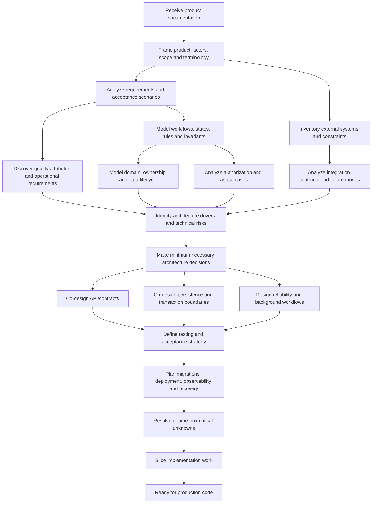

# Before Production Code: An Evidence-Based Backend Pre-Implementation Workflow

## Executive synthesis and research basis

This report addresses the period defined in the supplied research brief: from **“I received the product/application documentation”** to **“I am ready to start writing production code.”** It focuses on backend engineering rather than on a particular product, framework, or methodology.

The strongest conclusion from the research is that this period should **not** be treated as a miniature waterfall design phase in which every table, class, endpoint, and infrastructure component is predetermined. Nor should it be skipped by translating screens or requirements directly into ORM models. A better description is a **risk-reduction and progressive-commitment process**:

> Understand the product semantics first; turn those semantics into testable technical requirements; discover the domain, ownership, workflows, invariants, trust boundaries, and architecturally significant quality requirements; resolve or explicitly track important uncertainty; make only the architecture decisions that are justified now; then co-design contracts, persistence, failure handling, testing, and operations deeply enough that the first production implementation can proceed safely.

That synthesis is consistent across otherwise quite different sources. NASA's current software-engineering guidance requires software requirements to be analyzed for correctness, consistency, clarity, completeness, feasibility, verifiability, and traceability, with ambiguities and discrepancies resolved rather than silently interpreted by developers. Requirements analysis continues as requirements change. SEI guidance similarly argues that business goals and important quality attributes such as security, availability, and interoperability need to be understood before architecture can be evaluated intelligently.

At the same time, Fowler's work on evolutionary design and YAGNI argues against designing speculative future capability merely because it might eventually be useful; the ability to change software safely is more important than predicting every future design. Fowler and Sadalage make the same argument specifically for database evolution: schema changes can be treated as versioned, tested migrations rather than as evidence that the complete database must be fixed before implementation begins.

The result is neither “design everything first” nor “just start coding.” It is **design according to consequence and uncertainty**.

### Evidence base

The research deliberately prioritizes original or authoritative engineering material rather than generic development articles.

| Area | Principal evidence used | Main implication |
|---|---|---|
| Requirements | NASA SWE-050, SWE-051 and SWE-055 | Raw stakeholder documentation is not automatically an implementable technical specification; ambiguity, consistency, feasibility, verification, derived requirements, and acceptance need analysis. |
| Architecture and quality attributes | Carnegie Mellon SEI Quality Attribute Workshop, architecture evaluation, current architectural-risk work | Performance, availability, security, interoperability, modifiability, and other important qualities should be derived from business goals and considered before architecture decisions. |
| Domain modeling | Microsoft Architecture Center DDD guidance | For domain-rich systems, strategic domain analysis precedes tactical modeling and service decomposition; boundaries should evolve as understanding improves. |
| API design | Google API Improvement Proposals, Microsoft REST guidance, Zalando API guidelines | API resources should represent useful domain/resource semantics rather than blindly mirror tables; API-first is valuable when contracts coordinate independent consumers, but is an organizational/design approach rather than a universal ordering rule. |
| Security | OWASP ASVS, Threat Modeling, Authorization guidance and API Security Top 10 | Security requirements, trust boundaries, object ownership, authorization and abuse cases belong in design, not as a post-implementation review. |
| Reliability | Amazon Builders' Library and Microsoft Architecture Center | Remote calls fail; retries interact with load and side effects; timeouts, idempotency, retry policy, atomicity and compensation have to follow business semantics. |
| Data integrity and concurrency | PostgreSQL documentation | Constraints, isolation, locking, deadlocks and concurrent modification are part of correctness where multiple requests can affect the same data. |
| Evolutionary data design | Fowler/Sadalage | Database design can evolve safely when migrations, schema changes, data changes and tests are versioned and automated. |
| Testing | Google Software Engineering and Fowler | Test scope should match the risk and behavior being tested; TDD is one route to self-testing software, but writing tests first is not the only route. |
| Operations | AWS Well-Architected and OpenTelemetry | Operational readiness and the signals needed to understand production behavior should influence design before launch; traces, metrics and logs form complementary telemetry. |
| Risk | SEI continuous risk management and 2026 Agile Architecture Risk Management work | Unknowns and architecture risks should be identified, prioritized, reduced and revisited continuously rather than assumed away. |

An important distinction runs throughout the report:

**Broad engineering principles** are conclusions supported across multiple source families: clarify requirements, understand failure and security, identify quality requirements early, preserve data integrity, validate architecture against important scenarios, test important behavior, and explicitly manage uncertainty.

**Methodology-specific practices** include bounded contexts, aggregates and domain events in DDD; API-first development; strict TDD; UML; event sourcing; and microservice decomposition. These can be useful, but the evidence does not justify imposing any one of them on every backend.

**Source opinions** include Fowler's “Monolith First” heuristic or a particular organization's API conventions. They are valuable experience reports, not universal laws. Fowler himself emphasizes the context sensitivity and costs of distributed architectures.

**The workflow below is therefore a synthesis**, not a claim that a single authoritative body publishes exactly this sequence.

## What must be understood before detailed backend design

The most consequential pre-implementation mistake is confusing **the existence of documentation** with **understanding the system**. NASA distinguishes stakeholder expectations from the technical software requirements derived from them and explicitly calls for analysis of ambiguity, conflicts, feasibility, verifiability and completeness.

A backend engineer should progressively answer five classes of questions before committing to detailed implementation.

**Product semantics come first.** The developer needs to understand what the system is for, who interacts with it, which outcomes matter, where its responsibility starts and ends, and what “correct” means to the business. User journeys matter here not because the backend should mimic screens, but because journeys expose commands, state transitions, authorization boundaries, dependent operations and failure cases that a static list of entities may hide. Validation with stakeholders is also how assumptions, constraints and derived requirements are surfaced rather than quietly embedded in code.

**Requirements must then become engineering statements.** “Fast,” “secure,” “supports many users,” “users can manage orders,” or “never lose data” are not yet adequate technical requirements. Important statements should become sufficiently concrete to design and test: what operation, under what conditions, with what actor and permissions, at what volume, with what expected outcome, and with what acceptable failure behavior. SEI's quality-attribute work makes the same point for architectural requirements: architecture is much easier to reason about when quality concerns are expressed as scenarios tied to actual business objectives rather than as vague adjectives.

**The domain must be understood at the depth justified by its complexity.** Microsoft recommends strategic domain analysis before detailed tactical DDD or microservice identification in systems where business complexity matters. Tactical DDD then models entities, aggregates and services around behavior and invariants rather than treating entities as passive data bags. These are explicitly DDD-oriented recommendations, not requirements for every CRUD application.

The useful domain questions, even without “doing DDD,” are remarkably practical:

- What concepts does the business distinguish?
- Which words are ambiguous or used differently by different stakeholders?
- What actions can occur?
- What facts must always remain true?
- What states can an object occupy, and which transitions are legal?
- Which transitions depend on role, time, previous state, balances, inventory, or another entity?
- What is the authoritative owner/source of each piece of information?
- Which changes are business events rather than simple field updates?

This prevents the common reduction of behavior such as “approve,” “cancel,” “settle,” “expire,” or “transfer” into arbitrary CRUD updates. Google's resource-oriented API guidance reinforces the separation from storage: API resources need not—and generally should not be assumed to—correspond directly to database schema, and custom methods are appropriate when normal CRUD semantics do not represent the intended action.

**Security and ownership emerge as soon as actors, resources and flows are known.** Authentication answers who a principal is; authorization answers what that principal may do. OWASP specifically warns against object-level authorization failures in APIs, making resource ownership, tenancy and operation-level authorization backend design concerns rather than controller middleware to be bolted on later. Threat modeling is most useful beginning during design and then repeated as architecture changes; OWASP's process starts by modeling the system, data flows, trust boundaries and things that can go wrong.

**Quality attributes and operations shape architecture.** Expected traffic, latency, availability, durability, recovery, security, compliance, auditability, integration reliability and deployment constraints do not deserve equal analysis on every project, but the ones that matter must be discovered early because they can alter fundamental architecture. SEI explicitly places important quality-attribute discovery before architecture. AWS similarly treats reliability, failure recovery and operational readiness as architectural concerns, not merely post-development deployment work.

This produces an important ordering principle:

> **Learn semantics before committing to structure; learn quality constraints before committing to architecture; learn ownership and failure semantics before committing to distributed interactions.**

That principle is stronger than “always design the domain before the database” because there are legitimate exceptions.

### What comes first: domain, API, or database?

For a **typical business application with meaningful business rules**, the most defensible semantic ordering is:

**use cases and business rules → conceptual domain/state/ownership model → API and data model co-design → detailed schema and physical optimization.**

Microsoft's DDD guidance explicitly begins from domain analysis before tactical models, while Google's API guidance warns that API resources should not be regarded as storage records. Together, these undermine the idea that a backend should start by creating tables and then automatically expose them through CRUD endpoints.

But this is not a universal rule:

| Situation | Reasonable leading artifact |
|---|---|
| Integration product/public developer platform | An **API-first** contract can lead detailed implementation because the external interface is itself the product and multiple teams need an early stable coordination point. Zalando's API-first practice is a strong example of this organizational model. |
| Domain-heavy application | **Domain/workflow-first** is usually more useful because invariants, state and terminology are the difficult part; schema and interfaces should support those semantics. This is the domain-oriented ordering advocated by Microsoft DDD guidance. |
| Data-centric system around a pre-existing canonical schema | **Database-first** can be entirely rational because the schema may be an imposed system boundary rather than an implementation choice. |
| Straightforward CRUD administration system | Domain, API and schema can be sketched almost simultaneously because semantic complexity is low. |
| Existing public API | The existing **contract comes first** whether or not it is ideal; compatibility becomes a major requirement. |
| High-scale data system | Workload and access patterns may force early physical-data decisions such as partitioning, but only after workload requirements are understood. SEI's approach is to derive architecture from important quality scenarios rather than presume them. |

The anti-pattern is therefore **not simply “database-first.”** It is allowing an implementation representation to define business semantics **without checking whether those semantics are true**.

Likewise, Fowler and Sadalage's evolutionary database work is useful corrective evidence: databases are expensive to change carelessly, but modern migration, version-control, CI and deployment practices allow schemas to evolve. That weakens the old argument that the entire physical model must be locked before coding.

## Recommended sequence from specification to ready-to-code

The workflow is best understood as a dependency graph rather than a checklist. Several activities begin early, continue in parallel, and become more precise as information arrives.

The sequence can be made operational as follows.

| Stage | What the backend engineer actually does | Depends on | Can run in parallel with | Exit evidence |
|---|---|---|---|---|
| **Frame the product** | Identify business objective, users/actors, major capabilities, backend/system boundary, external parties, constraints, terminology and explicit out-of-scope behavior. | Documentation received | Integration inventory | Short scope note, actor list, glossary, initial questions |
| **Normalize requirements** | Convert narrative requirements into concrete use cases/scenarios; separate functional, quality, policy and constraint requirements; find contradictions, ambiguity and missing acceptance conditions. NASA recommends precisely this kind of consistency, clarity, feasibility and verifiability analysis. | Basic scope | External constraint research | Requirement/acceptance map plus assumption/question log |
| **Map workflows and business rules** | Walk happy, alternative, negative and cancellation flows. Identify commands, preconditions, postconditions, lifecycle states, transition rules and invariants. | Meaningful use cases | Quality-requirement discovery | Rule catalog and state/workflow model where useful |
| **Model the domain and ownership** | Identify important concepts, relationships, ownership, authoritative source, aggregate/transaction boundaries where relevant, and data lifecycle. Use DDD depth only where domain complexity justifies it. | Workflows/rules sufficiently understood | Security analysis | Conceptual domain/data model and ownership map |
| **Analyze security and trust** | Classify sensitive data; identify principals, tenants and object owners; define allowed actions; map trust boundaries and abuse cases; identify authentication constraints and audit requirements. OWASP recommends threat modeling during design and repeatedly as the system evolves. | Actors/data flows | Domain and integration modeling | Authorization matrix and proportionate threat model |
| **Discover architecture-driving quality requirements** | Make important expectations measurable enough to reason about: load, latency, availability, durability, RPO/RTO where relevant, data volume, regulatory constraints, audit, geographical restrictions and deployment limitations. | Product goals | Domain/security/integrations | Prioritized quality scenarios |
| **Analyze integrations and failures** | For each dependency determine authority, contract, credentials, quotas, latency, timeout, retries, idempotency, callbacks/webhooks, ordering, duplicate handling, partial failure and reconciliation. AWS stresses that remote failures and ambiguous timeout outcomes make retry semantics part of API design. | External-system inventory | Security/architecture | Integration contract/failure matrix |
| **Identify architecture risks** | Ask which decisions are expensive, unfamiliar, highly coupled or based on weak assumptions. Prioritize experiments or stakeholder questions accordingly. SEI treats risk management as continuous identification, prioritization and mitigation rather than a one-time exercise. | Previous stages | Everything else | Ranked risk/unknown log; spikes where necessary |
| **Choose the minimum sufficient architecture** | Decide only architecture needed to satisfy known drivers: deployment topology, major boundaries, persistence category, transaction model, synchronous versus asynchronous interactions, background processing, integration style and high-impact technology constraints. | Architecture drivers known | Early contract/data sketches | Small architecture sketch plus ADRs for consequential decisions |
| **Co-design data, transactions and interfaces** | Design schema around invariants/access/lifecycle, API around consumer use cases and domain semantics, and transaction boundaries around consistency requirements. Add DB constraints where appropriate. PostgreSQL explicitly supports database-enforced checks, uniqueness and referential integrity. | Domain + architecture baseline | Testing | ERD/schema sketch, API contract, consistency rules |
| **Design failure semantics** | For state-changing operations decide duplicate/retry behavior, idempotency, locking/concurrency approach, transaction isolation and recovery. For distributed workflows determine whether atomicity, eventual consistency or compensation is acceptable. | Workflows and data ownership | Contract design | Failure/retry/concurrency decisions |
| **Design test and verification strategy** | Map critical requirements, invariants, permissions, contracts and failure cases to appropriate test levels. Google's testing guidance separates test size from scope and encourages using the smallest useful level while retaining larger integration/system tests where dependencies matter. | Requirements and architecture | API/data design | Test matrix and initial acceptance cases |
| **Plan operational lifecycle** | Decide migration approach, environment assumptions, secrets/configuration, minimum telemetry, audit events, deployment/rollback strategy, backup/recovery obligations and who responds when something fails. AWS recommends designing workloads to emit useful operational signals rather than adding observability only after problems occur. | Architecture sketch | Testing | Operational baseline |
| **Resolve critical uncertainty** | Ask stakeholders, examine dependency docs, or perform explicitly disposable technical spikes. Do not require every uncertainty to disappear—only those capable of invalidating near-term implementation or architecture. | Risk inventory | All design work | Critical unknowns answered or bounded |
| **Plan first production slices** | Break work into end-to-end capabilities that exercise the important architecture, data, authorization and integration paths rather than building every infrastructure layer first. | Stable-enough baseline | — | First slice has acceptance, data, contract, security and test expectations |

### The activities that are inherently iterative

Requirements analysis is explicitly continuous in NASA's guidance, and OWASP similarly treats threat modeling as an iterative process. DDD boundary discovery is also iterative rather than a claim that the first model is permanently correct.

Consequently, these should **not** be checked off permanently:

**Requirements and assumptions** change as stakeholders answer questions.

**Domain models and terminology** improve as difficult cases are discovered.

**API and schema** should evolve together with behavior rather than freezing all details at inception; evolutionary database practices specifically exist to make such change manageable.

**Threat models and authorization** must be revisited when new actors, data flows or integrations appear.

**Architecture risks and quality attributes** should be re-evaluated when actual workload or constraints differ from estimates. SEI's 2026 work explicitly treats architecture-risk management as continuous during agile development.

**Performance assumptions** should progressively give way to measurements.

**Observability** should evolve from predicted failure modes to signals informed by real production incidents and behavior. AWS describes observability as a continuing operational capability, not merely initial logging configuration.

The practical gate therefore is not “all design finished.” It is:

> **The costliest known uncertainties have been addressed enough that implementing the next production slice is a controlled experiment rather than an architectural gamble.**

## Decision timing and competing approaches

A useful backend architect asks two different questions about every design issue:

1. **How important is this issue to investigate now?**
2. **How necessary is it to decide it now?**

Those are not the same question.

### Decide early

These are candidates for early commitment because mistakes may change fundamental semantics, external contracts, security boundaries or data integrity. Exactly which items qualify depends on the project.

| Decision | Why early |
|---|---|
| Product/system boundary and authoritative data ownership | Confusion creates duplicated authority and contradictory data. Domain/service boundaries similarly depend on knowing responsibility. |
| Important business invariants | They influence transactions, database constraints, APIs, concurrency and tests. DDD guidance treats invariants as part of domain behavior, while PostgreSQL provides constraints to enforce suitable invariants at persistence boundaries. |
| Tenant/object ownership and authorization semantics | Retrofitting object-level security after data access patterns and interfaces exist is dangerous; OWASP identifies broken object-level authorization as a major API risk. |
| Data sensitivity, residency or regulatory constraints | These can constrain architecture, storage, access, audit and deployment. OWASP's verification and threat-modeling guidance treats security requirements as part of design. |
| Money/inventory/other consistency-critical semantics | Whether duplicate execution or concurrent modification is acceptable determines transaction, isolation and idempotency design. |
| Public/external compatibility contracts | Once independent consumers depend on an interface, change becomes an ecosystem problem rather than just a refactoring problem; API-first organizations therefore invest heavily in contract review. |
| Architecture-driving quality targets | SEI explicitly recommends identifying significant quality attributes before architecture so the architecture can be evaluated against them. |
| Required recovery semantics for critical data | PostgreSQL documentation treats backup/recovery as a separate operational responsibility for valuable databases; the required recovery outcome influences the implementation chosen later. |

“Decide early” does **not** mean “specify every implementation detail.” For example, deciding that duplicate payment execution is unacceptable is more important initially than choosing the exact idempotency-key table layout.

### Investigate early, decide later

This category is often the most valuable because it prevents both ignorance and premature commitment.

| Topic | Early investigation | Why commitment may wait |
|---|---|---|
| Microservices versus modular monolith | Determine independent scaling, deployment, team ownership and failure needs. | Fowler/Lewis emphasize the operational and distributed-data costs of microservices; Fowler's “Monolith First” is a deliberately cautious heuristic rather than a law. |
| Caching | Identify expensive/read-heavy flows and freshness requirements. | Exact caches and eviction strategy should normally follow evidence of bottlenecks. |
| Messaging | Identify workflows that genuinely require asynchronous decoupling or long-running work. | Introducing a broker creates delivery, duplicate, ordering and operational concerns; don't add it merely for architectural fashion. Distributed workflows also introduce consistency/compensation issues. |
| Partitioning/sharding | Estimate scale, growth and access patterns early. | Most applications should not pay distributed-data complexity before the expected data shape justifies it; in genuinely high-scale systems the partition key can instead become an early decision. |
| Search technology | Discover search semantics and expected volume. | A separate search engine is unnecessary when ordinary database search satisfies requirements. |
| Exact persistence technology | Understand relational/document/event/time-series requirements. | Where requirements fit several technologies, delay commitment until the model and operational constraints clarify the tradeoff. |
| Detailed deployment topology | Discover isolation, availability, residency and workload requirements. | Instance counts, autoscaling settings and many cloud-specific details benefit from implementation and measurement. |
| Detailed observability implementation | Identify business and technical signals early. | Specific dashboards and alert thresholds usually improve once actual behavior is observable. |

### Deliberately defer

Fowler's YAGNI argument is specifically directed at speculative capabilities and abstractions, while also warning that evolutionary design only works when software remains easy to change through practices such as refactoring, testing and continuous delivery.

Consequently, normal candidates for deliberate deferral include exact internal class structures; abstraction layers built solely for hypothetical future requirements; speculative service extraction; most caches; most physical performance optimizations; exact index choices before query patterns exist; speculative event buses; future-region deployment; and general-purpose extensibility mechanisms with no current consumer.

These are not safe to defer when a known requirement specifically makes them architecturally significant. A high-scale workload with a known partitioning problem is different from an ordinary business application whose designer merely imagines billions of users.

### Where experienced approaches legitimately disagree

| Debate | Approach A | Approach B | Research-based synthesis |
|---|---|---|---|
| **Up-front vs evolutionary design** | Analyze architecture substantially before coding to avoid expensive structural mistakes. SEI emphasizes early architecture analysis against quality requirements. | Evolve design as knowledge grows; Fowler argues against speculative design and relies on refactoring/testing to keep change affordable. | Do early design for **high-cost/high-risk decisions**, then evolve reversible details. The disagreement is mostly about degree, not whether design exists. |
| **Domain-first vs API-first** | Domain-oriented design begins with business semantics/bounded contexts. | API-first organizations establish reviewed contracts early to coordinate producers and consumers. | Understand use cases first in either case. Lead with API when the external contract is the primary coordination boundary; lead with deeper domain modeling when semantic complexity is the dominant risk. |
| **Domain-first vs database-first** | DDD models business semantics independent of persistence details. | Data-centric or schema-constrained systems can reasonably begin from the authoritative data model. | Do not turn an implementation schema into a domain model accidentally. Where the database is itself an imposed contract, database-first can be appropriate. |
| **Fixed schema vs evolutionary schema** | Heavy up-front database design reduces migration risk. | Fowler/Sadalage show a mature alternative based on small version-controlled migrations, testing and deployment automation. | Plan integrity and costly data choices early; expect schema details to evolve. |
| **TDD vs tests after implementation** | TDD uses tests to drive design and creates rapid feedback. | Tests can be written after implementation while still producing self-testing code. Fowler explicitly distinguishes self-testing code from a requirement to use TDD. | Decide **test obligations** before coding; whether every test must be authored first is a team/method choice. |
| **Detailed architecture documents vs ADRs** | Large documents can provide comprehensive analysis in regulated or complex contexts. | Nygard's ADR approach captures individual significant decisions, context and consequences in small durable records. | Documentation should be proportional. Record consequential decisions and rationale; don't produce diagrams or prose merely because a template exists. |
| **UML vs informal diagrams** | Standard notation can reduce ambiguity when readers share it. | Boxes/arrows and textual models can be faster and easier for multidisciplinary teams. | The diagram's job is to answer a design question. Standard notation is valuable when precision/readership justifies its cost. |
| **Strict DDD vs pragmatic domain modeling** | Full strategic/tactical DDD can address very complex business domains. | Simple applications often do not need aggregates, context maps, domain events and repositories everywhere. | Preserve DDD's useful questions—language, boundaries, behavior, invariants—without mechanically applying every DDD pattern. |
| **Monolith vs microservices** | Independent services can improve independent deployment/scaling and business-capability alignment. | A monolith avoids network, consistency and operational costs; Fowler reports successful cases that split later after boundaries became clearer. | Distribution should solve a demonstrated boundary/scaling/organizational problem. It is not the default maturity level of a backend. |

## Reusable questions, artifacts, and readiness criteria

### Question bank for a new backend specification

A useful question bank is not a questionnaire to send mechanically to stakeholders. It is a diagnostic instrument: ask questions whose answers can change backend correctness or architecture.

| Area | Questions to answer |
|---|---|
| **Product and scope** | What user/business outcome is being produced? Who are the actors? What exactly belongs to this backend? What explicitly does not? What systems are authoritative for information we consume? |
| **Terminology** | Which domain terms need precise definitions? Are two words being used for the same concept? Is one word hiding different concepts? Do stakeholders disagree about terminology? |
| **Use cases** | What initiates each operation? What does success mean? What alternatives, cancellations and failures exist? What happens when the operation is repeated? |
| **Business rules** | What must always be true? Which conditions block an operation? Which rules vary by actor, customer, region, plan, time or object state? Who may override a rule? |
| **State and lifecycle** | What states exist? What transitions are legal? Which transitions are irreversible? Can transitions occur asynchronously or expire automatically? What must happen when a transition partially fails? |
| **Data** | Who owns each object? What is its source of truth? What relationships and uniqueness rules exist? Which fields are historical versus current? What retention/deletion requirements apply? What cannot safely be deleted? |
| **Consistency and transactions** | Which changes must succeed or fail together? What stale data is tolerable? Can simultaneous requests modify the same object? What happens on conflict? Could duplicate requests cause real-world harm? PostgreSQL's concurrency guidance makes these questions part of database correctness rather than mere performance tuning. |
| **API/contracts** | Who consumes the interface? Is it public, partner-facing or internal? Is backward compatibility required? Are operations naturally CRUD or business commands? What pagination/filtering/error/idempotency semantics are required? Google explicitly separates API resources from database layout. |
| **Authentication** | Who establishes identity? Human users, services, devices? Is SSO/federation required? How are service credentials managed? OWASP distinguishes authentication from authorization and recommends established protocols rather than conflating the two. |
| **Authorization** | For every important operation, which principal may act on which object under which conditions? Is authorization role-based, ownership-based, tenant-based or attribute/policy-based? Can administrators cross tenant boundaries? How are denials tested? |
| **Sensitive data/security** | What data is confidential or security-sensitive? Where does it flow? Which trust boundaries are crossed? What could an attacker abuse rather than merely call incorrectly? What actions require audit trails? |
| **Integrations** | What does each dependency promise? What authentication, rate, payload, timeout and availability constraints exist? Can it send duplicates/out-of-order callbacks? How will we reconcile missed events? Who is authoritative during disagreement? |
| **Failure/recovery** | What if a dependency succeeds but the response is lost? Which operations can be retried safely? What if the process crashes halfway through? Is compensation possible? AWS notes that a timed-out request can already have produced a side effect, which is why idempotency matters. |
| **Background processing** | Which work need not complete in the request? Must jobs run once, at least once, or effectively once? What happens to poison messages? Can work be replayed? Does ordering matter? |
| **Performance** | Which operations have user-visible latency requirements? What are normal and peak request rates? Data size and growth? Expensive queries? Batch sizes? What evidence supports these numbers? SEI recommends concrete quality scenarios because vague “fast/scalable” requirements are insufficient architecture drivers. |
| **Availability/durability** | What outages are tolerable? Which functions must remain usable during dependency failures? How much data loss is acceptable? How quickly must service/data recover? |
| **Audit/compliance** | Which actions need immutable attribution? Must old values be reconstructable? Are there retention, deletion, consent, regional or segregation requirements? |
| **Observability** | How will operators know the major workflow succeeded? Which business failures differ from infrastructure failures? Which metrics, logs and traces are necessary to diagnose the expected failure modes? |
| **Deployment/migration** | Does deployment require zero downtime? Can old/new app versions coexist during migration? How will schema and data migrations be versioned and rolled forward/back? Fowler/Sadalage recommend keeping migrations and database artifacts versioned with application changes. |
| **Backup/recovery** | What needs backing up, how often, and how will restoration be validated? PostgreSQL's official documentation distinguishes logical, physical and continuous-archiving/PITR approaches, so the chosen mechanism should follow recovery requirements. |
| **Testing** | Which behaviors are business-critical? Which rules can be unit-tested? Which need a real database? Which integration contracts need tests? Which flows require end-to-end tests? Google notes that test scope and test size differ and that real dependencies sometimes require larger tests despite their additional cost. |
| **Uncertainty** | What are we assuming? Which assumptions, if wrong, invalidate the architecture? Which question must be answered before the first slice? Which can safely be learned from implementation? Who owns each unresolved question? |

### Recommended artifacts: create evidence, not paperwork

No artifact is universally mandatory. SEI's early architecture-analysis guidance explicitly allows analysis to start with incomplete artifacts and grow in depth as higher confidence becomes necessary.

A practical criterion is:

> An artifact earns its maintenance cost if it **resolves ambiguity, coordinates people, protects an important invariant, records a consequential decision, or reduces a material risk**.

| Artifact | Purpose | Worth creating when | Bureaucracy when |
|---|---|---|---|
| **Scope/context note** | Defines objective, boundaries, actors and dependencies | Almost every nontrivial backend | It becomes a restatement of the entire product spec |
| **Domain glossary** | Creates shared vocabulary | Terms are specialized, overloaded or disputed | Domain vocabulary is tiny and universally understood |
| **Requirement/acceptance map** | Connects important requirements to observable success | Multiple workflows or stakeholders exist; acceptance is ambiguous | Every trivial implementation detail is given heavyweight traceability |
| **Open-question/assumption log** | Prevents silent guesses | Almost always; especially under incomplete specifications | Resolved questions are never removed and the document becomes archaeology |
| **Workflow/state diagram** | Makes lifecycle and transition rules explicit | State-dependent behavior, approvals, payments, jobs, fulfillment, etc. | The operation truly is stateless/simple CRUD |
| **Domain/context model** | Clarifies concepts, responsibilities and boundaries | Business language or rules are complex | Tactical DDD notation is generated merely because DDD is fashionable. Microsoft positions these techniques specifically for domain complexity. |
| **Conceptual ERD/data model** | Clarifies relationships, ownership, cardinality and integrity | Persistent relational data is important | Every physical column/index is frozen before workflows are understood |
| **API/OpenAPI contract** | Coordinates producers/consumers and defines interface semantics | Independent client/team, public/partner API, integration-heavy work | Single-team private functions are exhaustively specified before any consumer needs stability |
| **Authorization matrix** | Maps actor × resource × operation × conditions | Multiple roles, tenants, ownership rules or sensitive operations | All authenticated users have the same tiny permission surface |
| **Threat/data-flow model** | Shows assets, trust boundaries and abuse paths | Public attack surface, sensitive data, money, multiple trust zones | Low-risk internal utility receives a regulatory-scale threat-model package. OWASP recommends proportional, iterative threat modeling rather than treating it as a one-time document. |
| **Architecture sketch** | Shows major components, boundaries and data flows | Anything beyond a trivial process | Huge diagram inventories describe classes rather than significant structure |
| **ADR** | Records context, decision, alternatives and consequences | A decision will be questioned later or is costly to reverse | An ADR is written for every library import. Nygard's intended form is lightweight and decision-oriented. |
| **Quality-attribute scenarios** | Makes NFRs actionable | Availability, scale, latency, security or interoperability can drive architecture | The system has no meaningful quality tradeoff and generic “best possible” targets are invented. |
| **Integration/failure matrix** | Captures dependency contracts, retryability and reconciliation | External systems/background workflows matter | No remote dependencies exist |
| **Test strategy/matrix** | Shows how critical behaviors/invariants are verified | Almost any production backend | It specifies every individual test before implementation |
| **Operational readiness note** | Captures deploy, migration, telemetry, backup/recovery and incident assumptions | Durable production system | Disposable prototype with no production lifecycle |
| **Risk/unknown register** | Prioritizes technical uncertainty | New domain, technology, integration or architecture | Risks are recorded but never ranked, owned or acted on. SEI emphasizes continuous action on the most important risks. |

### Ready-to-code criteria

The research does not reveal a single industry-standard “backend Definition of Ready.” NASA, SEI, OWASP, AWS, Google and Fowler emphasize different concerns rather than a universal gate. A useful readiness gate is therefore a synthesis of their concerns, scaled according to risk.

| **Must know before the affected production code** | **Should know, or explicitly bound** | **Can usually discover while implementing** |
|---|---|---|
| What outcome the feature/system is supposed to produce | Expected normal/peak workload at useful order of magnitude | Exact internal class/package organization |
| Actors and the system boundary | Likely growth profile | Most low-level abstractions |
| Meaning of domain terms used by the first slice | Availability/recovery targets where not architecture-critical | Fine-grained refactorings |
| Success/acceptance behavior | Operational dashboard/alert detail | Exact indexes until access patterns become concrete, except where known scale makes them architecture-critical |
| Business invariants relevant to the slice | Longer-term API evolution strategy for purely internal APIs | Caching where no demonstrated need exists |
| State transitions relevant to the slice | Future service extraction candidates | Microservice decomposition not justified by current requirements |
| Data ownership/source of truth | Broader domain boundaries outside the first slice | Speculative extension points |
| Authorization semantics for affected data/operations | Full performance tuning plan | Exact autoscaling parameters |
| Sensitive-data/trust-boundary implications | Long-range capacity forecasting | Hypothetical multi-region architecture |
| Required transaction/consistency behavior | More detailed failure-injection scenarios | Generalized framework code with no current consumer |
| Important external-contract behavior | Detailed observability thresholds | Performance optimization unsupported by measurement |
| Behavior under obvious duplicate/concurrent/failure conditions when harmful | Detailed backup implementation where high-level recovery requirements are already known | Minor storage-layout refinements |
| Architecture-driving NFRs | Less consequential technical choices | Reversible implementation details |
| Critical risks/unknowns that could invalidate the chosen approach | Noncritical open questions with owners | New information that only implementation can expose |
| How critical behavior will be tested | — | — |

A system is **not** “not ready” merely because unanswered questions remain. It is not ready when unanswered questions can plausibly invalidate the production work about to start and nobody has intentionally accepted that risk.

## Risk-adjusted workflows and common anti-patterns

The core process is universal in intent but **not in ceremony**. The riskier the system, the more explicit the evidence should become.

| Project type | Universal minimum | Additional emphasis |
|---|---|---|
| **Small CRUD application** | Understand scope, actors, terminology, validation/business rules, ownership, authorization, basic schema, API semantics, migration/testing/deployment basics | Keep documentation light. A short requirements note, ERD/schema sketch, endpoint contract, permission table and question log may be enough. Do not introduce DDD ceremony or distributed architecture without a real need. |
| **Normal business application** | All of the above plus workflow/state analysis, explicit invariants, external integration analysis, relevant quality requirements, failure cases, test strategy, operational baseline | Lightweight ADRs, API contract, ERD, authorization matrix, migration plan and failure/integration notes usually pay for themselves. |
| **Complex domain-heavy application** | Standard workflow | Spend much more effort on terminology, business capabilities, invariants, state transitions, ownership and domain boundaries before schema/service decomposition. Strategic and tactical DDD become more valuable here. |
| **High-scale system** | Standard workflow | Make workload assumptions explicit early; investigate contention, partitioning, hot keys, idempotency, queues/backpressure, degradation, SLOs, observability and operational load. Architecture should be driven by concrete quality scenarios rather than hypothetical scale. |
| **Money or sensitive-data system** | Standard workflow | Increase rigor around authorization, auditability, data classification, threat modeling, transaction semantics, concurrency, duplicate execution, reconciliation, recovery and human/manual failure handling. OWASP and AWS reliability guidance make many of these first-class design concerns. |

The key idea is **same questions, different depth**.

A five-table internal CRUD tool and a payment ledger should both answer “who owns this data?” but they should not produce the same volume of architecture documentation.

### Anti-patterns indicating coding has started too early

| Anti-pattern | Why it is dangerous | Evidence/reasoning |
|---|---|---|
| **Specification → ORM models immediately** | The developer commits to storage concepts before validating workflows, terminology, invariants and ownership. | Domain analysis guidance starts with the business domain; Google explicitly states that API resources should not be expected to mirror database schema. |
| **Everything becomes CRUD** | Business commands and state transitions disappear into arbitrary field updates, weakening validation and authorization semantics. | Google supports custom operations when standard resource methods do not represent the intended action; DDD treats entity behavior/invariants as more than passive data. |
| **“We'll add authorization later”** | The model may omit tenant ownership, object-level policies and privileged transitions, forcing fundamental changes later. | Broken object-level authorization remains a major OWASP API risk. |
| **Only modeling the happy path** | Remote calls, concurrent requests, retries, cancellations and partial completion create states the happy path never exposes. | AWS explicitly designs for unavoidable remote failure; Microsoft documents compensation for partial distributed workflows. |
| **Retries without semantic idempotency** | A timed-out request may actually have succeeded; blind retry can duplicate side effects. | AWS's Builders' Library treats client-request identifiers and atomic idempotency recording as techniques for making retries safe. |
| **Ignoring concurrency because “the database handles it”** | Database isolation levels permit different concurrent behaviors, and application logic can still race. | PostgreSQL devotes explicit concurrency-control guidance to isolation, locking, deadlocks and consistency. |
| **Picking microservices as a default** | Distribution introduces remote failure, operational automation and cross-service consistency problems before domain boundaries may be understood. | Fowler/Lewis detail those costs; Fowler's “Monolith First” argues that boundaries are often easier to discover after learning from a monolith. |
| **Designing for imaginary global scale** | Complexity is paid immediately for an uncertain requirement. | Fowler's YAGNI explicitly argues against speculative capabilities while preserving practices that make future change safe. |
| **No measurable NFRs** | “Fast,” “available,” or “scalable” cannot meaningfully drive architecture decisions. | SEI uses concrete quality-attribute scenarios precisely to connect business needs to architecture. |
| **No assumption/unknown tracking** | Guesses silently turn into architecture. | SEI continuous risk management calls for identifying, prioritizing and responding to what can go wrong as an ongoing activity. |
| **Treating observability as a production-week task** | The architecture may provide no useful signals for important workflows or failures. | AWS recommends planning workload telemetry and operational readiness as part of workload design. |
| **Freezing the entire schema upfront** | Developers either resist legitimate learning or perform uncontrolled migrations later. | Fowler/Sadalage demonstrate a competing evolutionary model based on versioned, tested migrations. |

### Anti-patterns indicating over-design

Starting too early has an opposite failure mode: refusing to code until uncertainty reaches zero.

Warning signs include choosing queues, caches, Kubernetes, CQRS, event sourcing or microservices before a requirement demands their costs; designing abstract frameworks for possible future features; attempting to model the entire enterprise domain before the first bounded capability; specifying every endpoint response and table column despite unresolved business rules; building enormous architecture documents that do not correspond to real decisions; and optimizing performance without a workload hypothesis or measurement plan.

Fowler's YAGNI is explicitly an argument against such presumptive complexity, while SEI's early architecture-analysis approach accepts incomplete artifacts and progressively increases analysis depth as greater confidence is needed.

The right target is therefore **sufficient certainty, not total certainty**.

## Practical repeatable backend workflow

The research can finally be reduced to a workflow that a backend developer can use repeatedly without turning every new application into a formal systems-engineering program.

**Start by reading for meaning, not implementation.** On the first pass, identify the product objective, actors, boundaries, external systems and unfamiliar terminology. Do not design tables or endpoints yet. On the second pass, mark statements that imply business rules, lifecycle transitions, permissions, consistency constraints, integrations, security obligations or quality requirements. Requirements engineering guidance supports explicitly separating and validating these concerns instead of assuming the supplied specification is already technically complete.

**Write down unknowns immediately.** Maintain one lightweight list containing questions, assumptions, contradictions, technical risks and owner/status. Rank them by architectural impact rather than asking stakeholders dozens of questions indiscriminately. An unanswered question about button wording is not equal to an unanswered question about whether two account withdrawals may execute concurrently. Continuous risk management is fundamentally about finding what can go wrong, ranking importance and acting on the important risks.

**Walk the important use cases end-to-end.** Include successful, rejected, repeated, concurrent, cancelled and partially failed executions where relevant. This is where apparent “entities” become actual business behavior.

**Extract the business model.** Establish terminology, entities/concepts, lifecycle states, transitions, invariants, source-of-truth ownership and important business events. For a simple CRUD backend this may occupy a page; for a rich domain it may justify bounded contexts, aggregates and deeper DDD analysis.

**Overlay security rather than postponing it.** For every important operation ask who may perform it, on whose data, under which conditions. Draw trust/data-flow boundaries when the system is public, multi-tenant, handles sensitive information or talks to multiple external systems. Record audit requirements while the business actions are still visible. OWASP's authorization and threat-modeling guidance strongly supports this timing.

**Discover only the nonfunctional requirements that can change the architecture.** Obtain useful estimates or targets for scale, latency, availability, durability, recovery, compliance and deployment constraints. Do not manufacture massive-scale requirements merely to make the architecture interesting. SEI recommends deriving these architectural drivers from actual business/mission goals.

**Analyze every remote dependency as a failure boundary.** Determine timeout behavior, retries, quotas, duplicate delivery, authentication, source-of-truth rules and reconciliation. For any side-effecting operation that might be repeated, explicitly decide whether idempotency is required. AWS emphasizes that timeouts create ambiguous outcomes and that unsafe retries can repeat side effects or worsen overload.

**Choose the simplest architecture consistent with what you now know.** Decide deployment boundaries, persistent-store category, transaction boundaries, synchronous/asynchronous interactions and background-work strategy only as far as required by current architecture drivers. Record consequential choices and their rationale; leave reversible implementation details open. This combines SEI's architecture-risk emphasis with the evolutionary-design caution represented by Fowler.

**Then co-design interface and persistence.** API contracts should express consumer/business semantics, not automatically expose tables. Database design should enforce appropriate integrity and support transactions and access patterns. API, domain and schema will often refine one another at this point rather than forming a strict one-directional pipeline.

**Make failure behavior explicit before implementing state-changing operations.** Decide transaction scope, concurrency expectations, duplicate behavior, retries, idempotency, queue semantics and, where distribution is unavoidable, compensation/reconciliation. PostgreSQL documents concurrency as a correctness concern, while AWS and Microsoft demonstrate why reliability mechanisms cannot simply be added blindly after the happy path.

**Define how you will know the system is correct.** Turn acceptance scenarios, invariants, authorization rules and integration contracts into a test strategy. Some should become small domain tests, some persistence/integration tests, and a smaller set should cross the complete system boundary. TDD can be used, but the evidence does not justify making strict test-first development a universal prerequisite; Fowler explicitly separates TDD from the broader objective of self-testing software.

**Think through production before production exists.** Know how schema migrations will run, what minimum deployment/rollback approach exists, how secrets/configuration are handled, what must be logged or audited, which metrics/traces reveal success or failure, and what recovery/backup obligations exist. The details may evolve, but AWS operational guidance places operational readiness and observable workload behavior within architecture work rather than after it.

**Use spikes only to retire consequential uncertainty.** If a new database capability, third-party API, protocol, performance assumption or deployment mechanism could invalidate the architecture, perform a time-boxed disposable experiment. Experimental code is evidence gathering, not an excuse to smuggle an unreviewed prototype into production. This is consistent with SEI's risk-driven approach: deeper analysis is warranted around the uncertainties with the largest potential consequences.

**Finally, choose one end-to-end production slice and perform the readiness check.** Before writing it, the developer should be able to state, in plain language:

> I know what this capability means; who may invoke it; what rules and invariants it must preserve; what state/data it owns or modifies; what contract it exposes; what must happen under duplicate, concurrent and expected failure conditions; which architecture requirements constrain it; how I will verify it; and which remaining uncertainties are consciously deferred.

That is a much stronger definition of **“ready to code”** than “the ERD is finished” or “all requirements are documented.”

Conversely, it avoids the opposite trap of believing that implementation should wait until every design question is permanently settled. Evolutionary database design, iterative requirements analysis, iterative threat modeling and continuous architecture-risk management all point toward the same broader principle: **learn enough to make the next consequential decision safely, preserve the ability to change the rest, and repeat the process as implementation produces new evidence.**

The resulting repeatable flow is:

**Product intent → scenarios → requirements/questions → business rules and states → domain/data ownership → security/trust → architecture-driving qualities → integrations/failure modes → risk reduction → minimum architecture → API/data/transaction co-design → test and operational design → first vertical slice → production code → repeat.**

That ordering is the central research finding. It preserves the things that authoritative requirements, architecture, security, reliability and data-engineering sources consistently treat as dangerous to discover too late, while deliberately avoiding premature decisions that evolutionary-design sources show can be learned more economically from implementation.